# GENZ HIRING

_A cutting-edge tool designed for resume analysis and job seeker assistance, built using LLM, LangChain, ChatGPT 3.5 Turbo API, SERP_
<br><br><br>

### 🌟 MILESTONES 🌟

🏆 Runners, 24 Hours Googleathon 2.0, Google Developers Student Clubs, SNS Institutions - November 20, 2023
<br><br><br>

### PROTOTYPE VIDEO


https://github.com/user-attachments/assets/94b19b79-0bff-4f01-8781-92870f433193


<br><br>

### HOW TO EXECUTE

#### Terminal

```
git clone https://github.com/raghavavidyapriya/genz-hiring.git
```

<br>

```
cd genz-hiring/
```

<br>

```
pip install -r requirements.txt
```

<br>

#### Inside the project directory

Setup .env file

```
OPENAI_API_KEY = "your api key, supports only ChatGPT 3.5 Turbo"
SERP_API_KEY = "your api key"
```

<br>

#### Terminal

```
python main.py
```

<br>

#### Web Browser

```
http://127.0.0.1:8000/
```

<br>

### PROBLEM STATEMENT

In the realm of employment, there is a need for an AI-powered solution to optimize and enhance job application processes. The proposed system should guide job seekers through an efficient application workflow, utilize advanced document recognition for credential verification, and provide real-time updates on application progress. Security measures must be robust to safeguard personal and professional information, and the system should continually learn from user interactions and industry changes for continuous improvement.
<br><br><br>

### DOMAIN

Communication and Growth system
<br><br><br>

### OBJECTIVE

Optimizing Job Application Processes through AI Assistance LLM based: Resume Summary, Score Applicants based on JD Description
<br><br><br>

### INTRODUCTION

Introducing our AI-powered Resume Analysis Tool, a cutting-edge application designed to enhance your job search experience using advanced technologies like LangChain, Generative AI, and Large Language Models (LLM) from OpenAI. This tool not only scores your resume based on relevance and quality but also offers contextual improvements and skill relevance analysis to help you stand out. Leveraging SERP for personalized job recommendations, it provides tailored suggestions to align with your career goals. Additionally, the tool can create customized resumes, perfectly suited to specific job applications, enhancing your chances of success. Built with the Flask web framework and Python, it's an essential companion for students, professionals, and job seekers aiming to optimize their career opportunities.
<br><br><br>

### FEATURES

- Resume scoring system <br>
- Contextual Improvements, Skill Relevance Analysis <br>
- Tailor made new resume for users <br>
- Personalized job recommendations
  <br><br><br>

### TECHNOLOGIES USED

- LangChain <br>
- Generative AI <br>
- Large Language Models (LLM) <br>
- OpenAI <br>
- Search Engine Results Page (SERP) <br>
- Flask Web framework
  <br><br><br>

### END USERS

1. Students
2. Professionals
3. Job Seekers
   <br><br><br>

### OUTPUTS

- Home Page <br><br>
  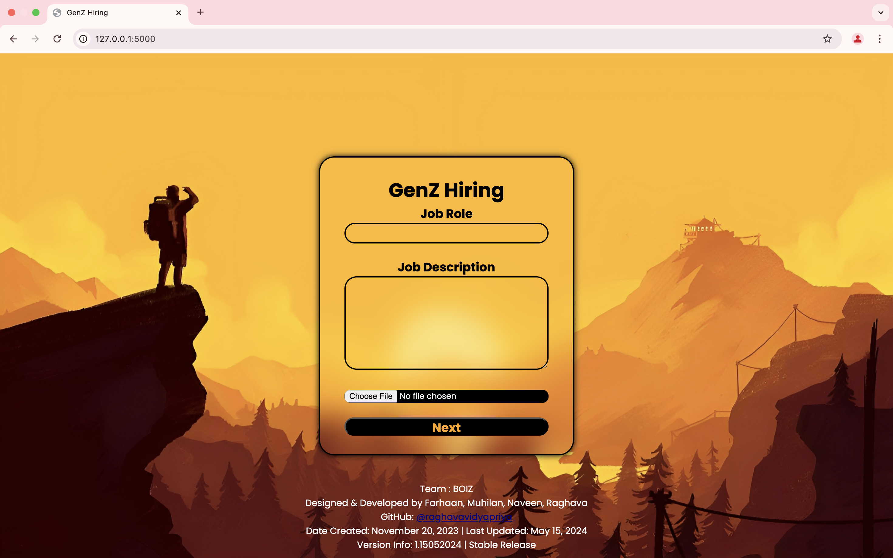

- Overview <br><br>
  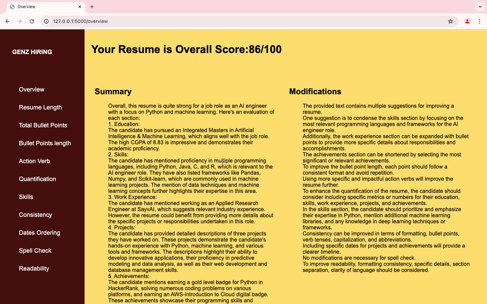

- Job Suggestions <br><br>
  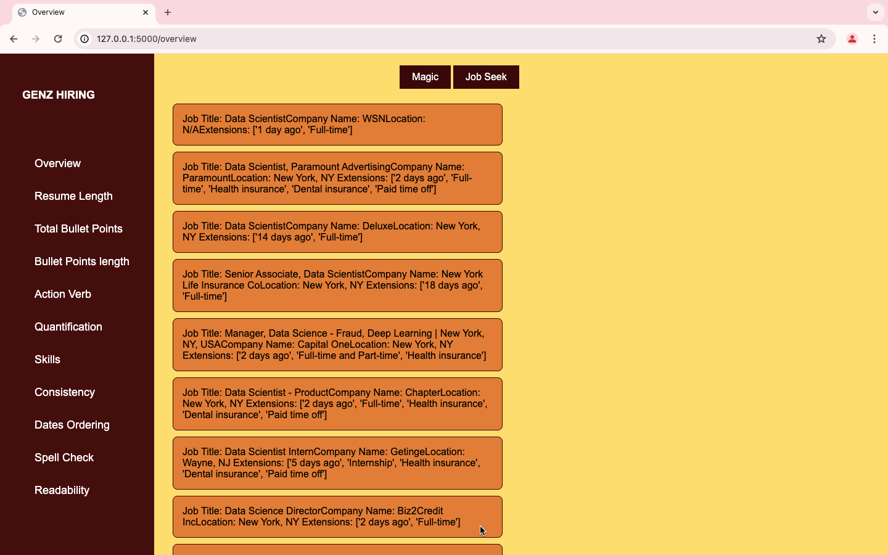

- Tailor Made Resume <br><br>
  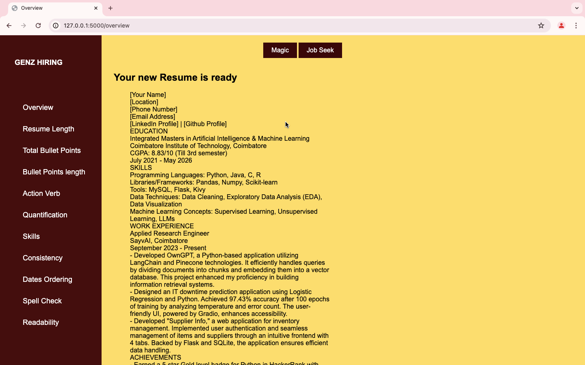

- Resume Length <br><br>
  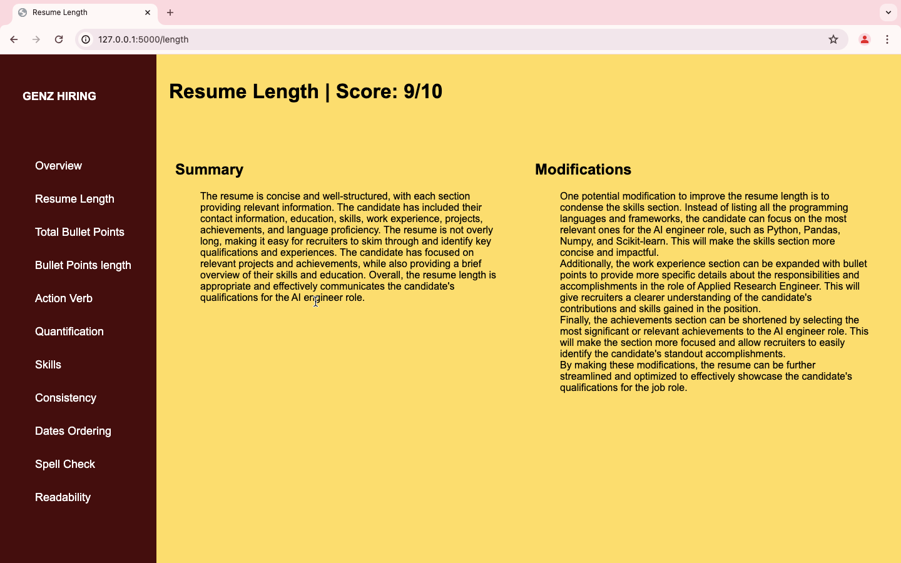

- Total Bullet Points <br><br>
  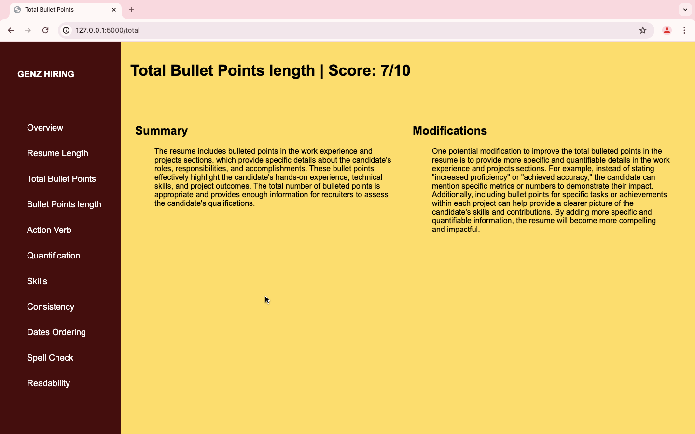

- Bullet Points Length <br><br>
  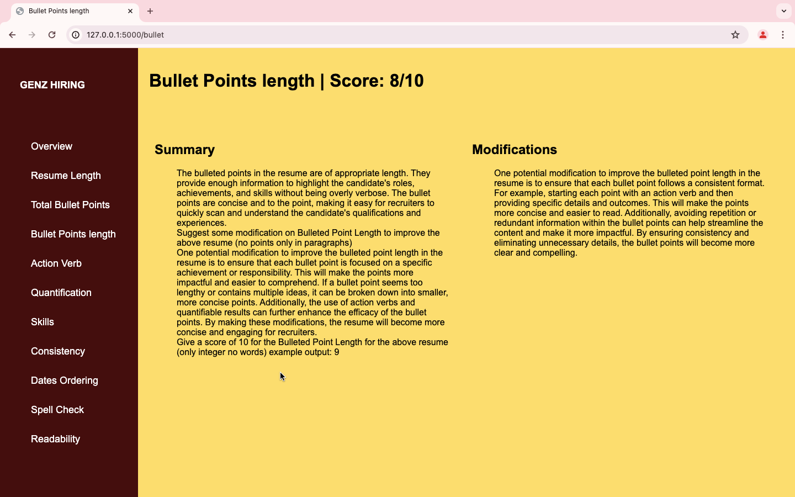

- Action Verb <br><br>
  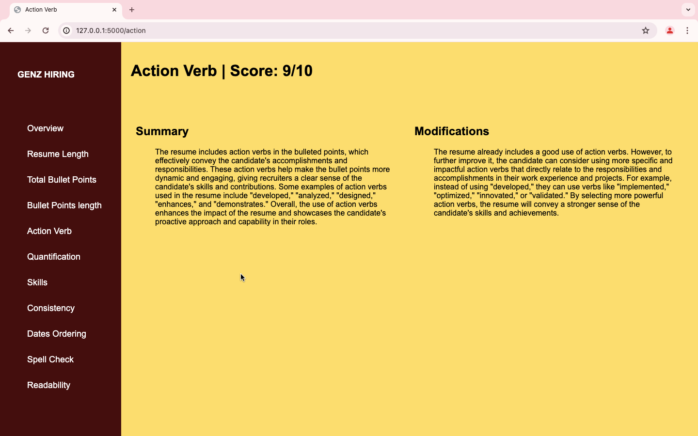

- Quantification <br><br>
  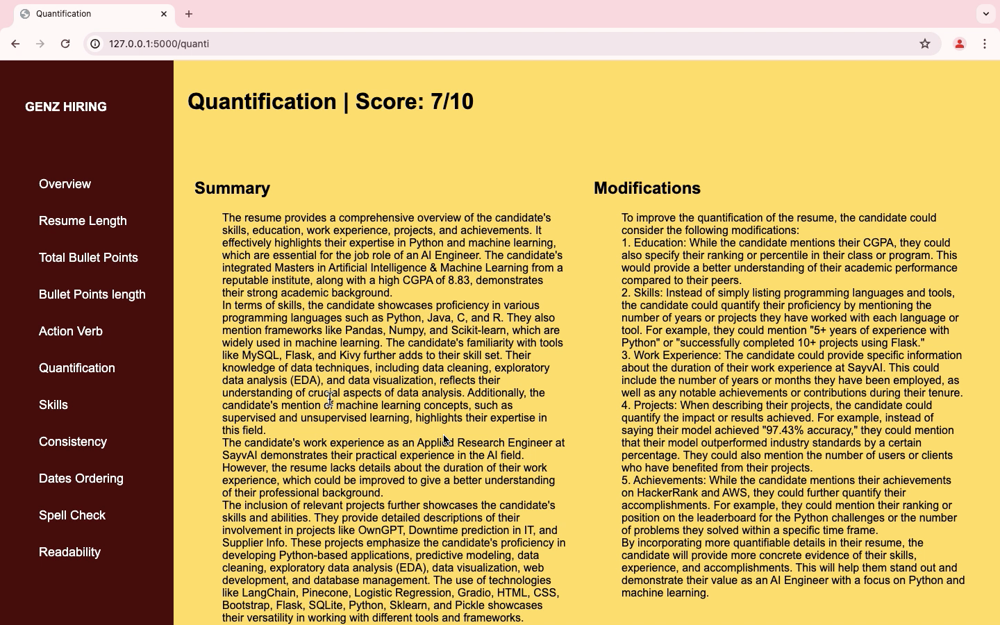

- Skills <br><br>
  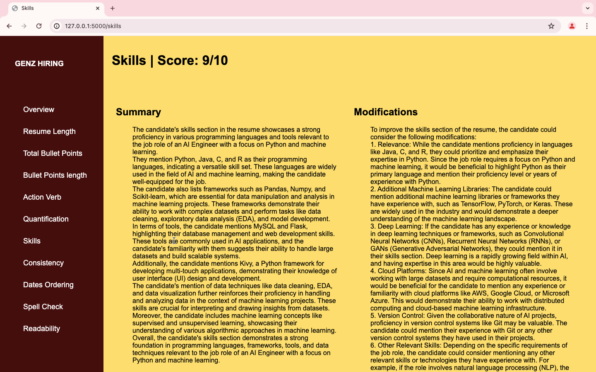

- Consistency <br><br>
  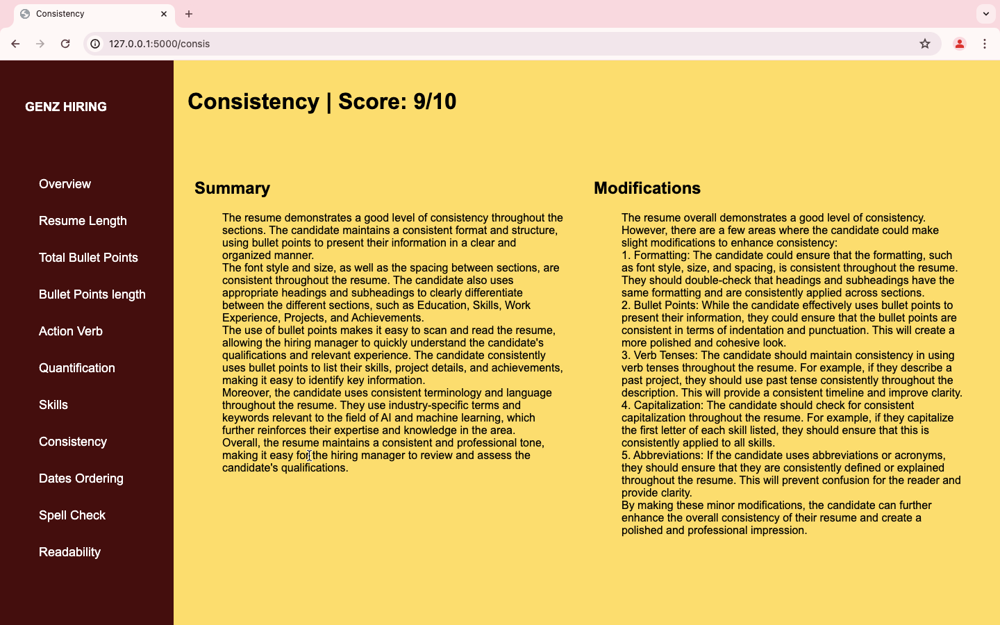

- Dates Ordering <br><br>
  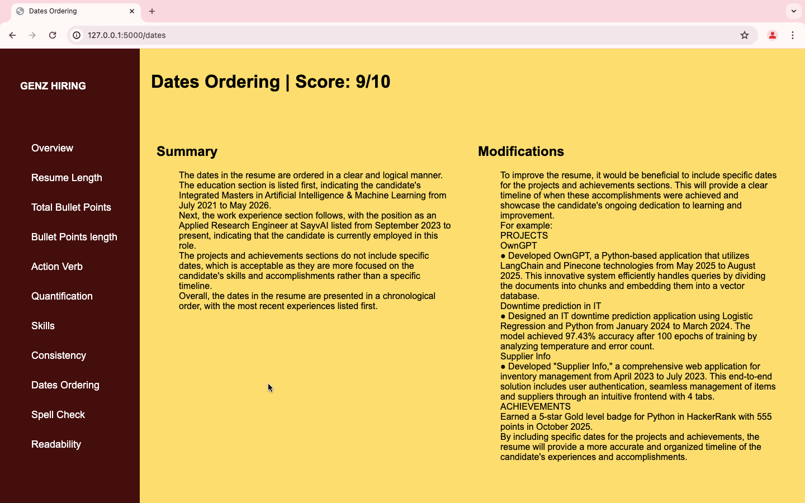

- Spell Check <br><br>
  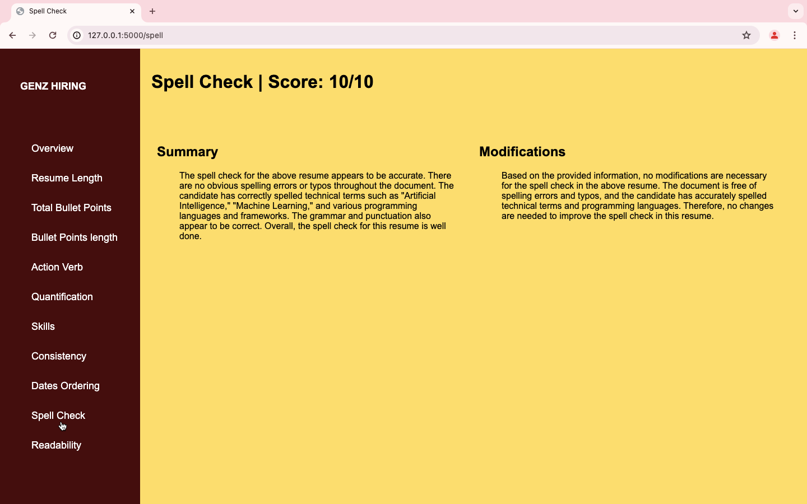

- Readability <br><br>
  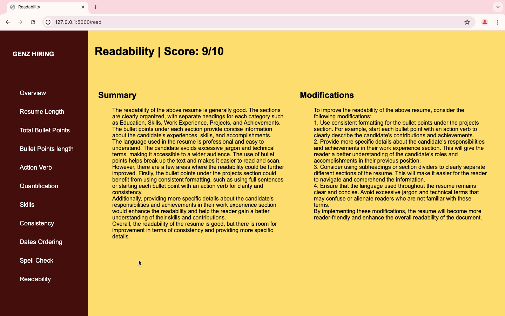

<br>

### DESIGNED & DEVELOPED BY

- FARHAAN
- MUHILAN
- NAVEEN
- RAGHAVA
  <br><br>

_END OF README_
